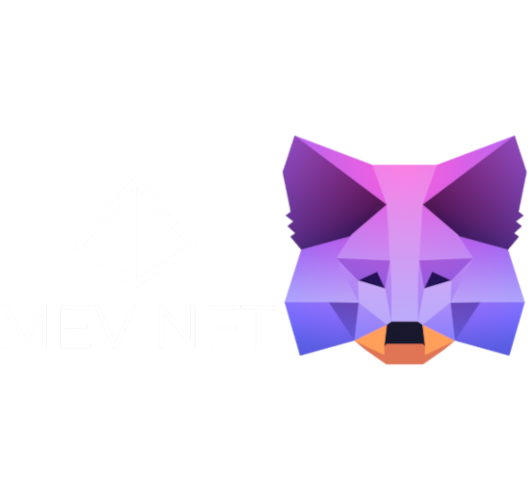
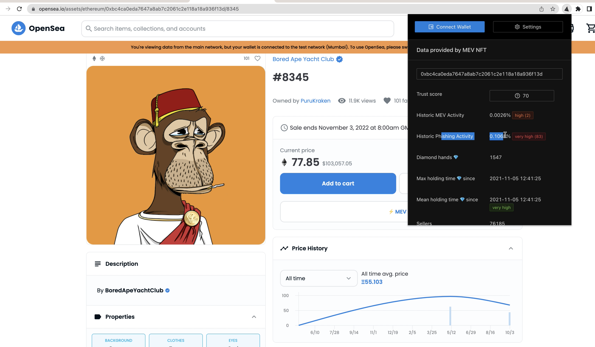
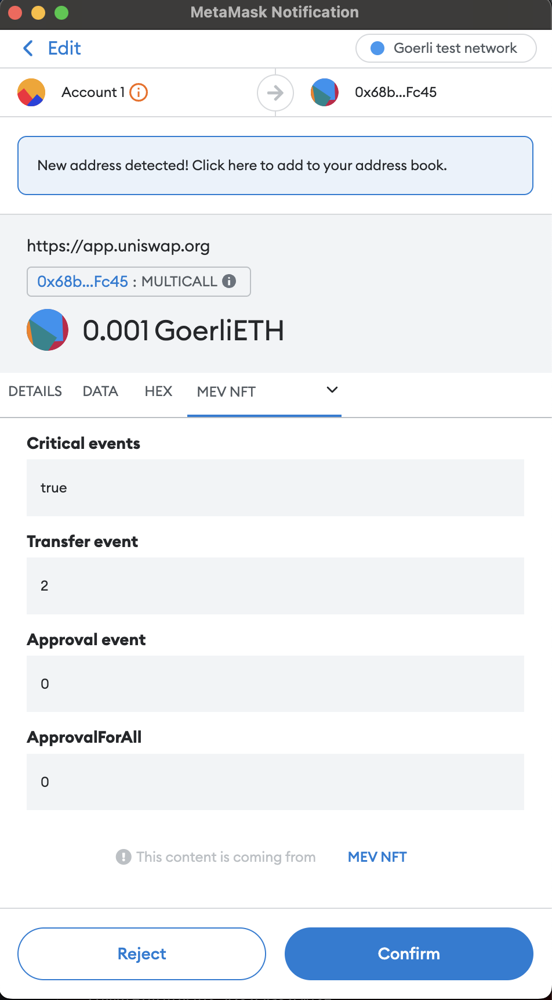

# MEV NFT: Protecting User MetaMask!

Welcome to MEV NFT repository!

Within this repository you will find:
- Google Chrome Plugin for NFT Marketplace UI customization
- MM Snap Transaction Insights
- MM Snap snap_getBip32Entropy for Flashbots transactions
- Gnosis Safe protection by signing transactions with a encrypted secret in MetaMask 

## Google Chrome Plugin

Provides NFT data analytics insights by injecting ntml code in NFT Market Place (OpenSea) website and imports MetaMask snaps.

## MM Snap Transaction Insights

We are using MetaMask Transaction Insights to determine if transaction will transfer user assets. There have been many hacks were website front end was hijacked or website was giving false information about expected transaction. Imagine scenario were user signs transaction in order to be whitlisted for NFT minting however he is actually transfering his NFT's!

Our technical solution is to send transaction transaction calldata to Tenderly transaction simulation API. Transaction simulation returns Transaction Logs and we can see in logs if there was a critical event logged as Transfer, Approval, ApprovalForAll.

## Flashbots transactions

Users now use Flashbots as custom networks in MetaMask. Flashbot network can't be added automatically by website because Flashbot network has the same chain id as Ethereum main net.

Our solution is to sign transaction and send to Flashbot network by using MetaMask Snap snap_getBip32Entropy method.

## Gnosis Safe

Recently hacks due to private key compromisation have been increasing. Our favorite actor Bill Murray lost $185,000 during his NFT charity auction!

We want to store assets in a Gnosis Safe and the only ways how to transfer assets are by having the specific device with a MetaMask account. Transaction needs a signatures from private key AND the encrypted secret inside the MetaMask.

